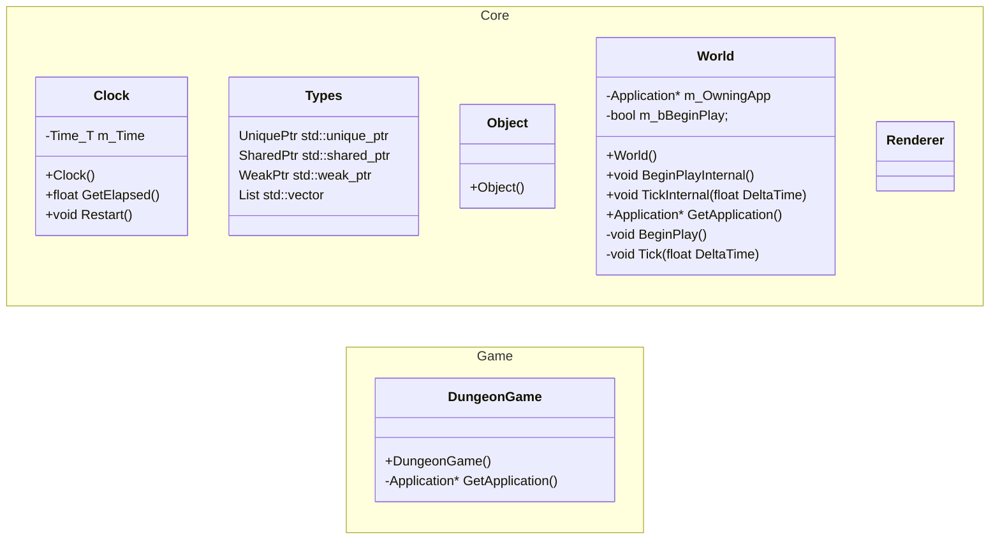
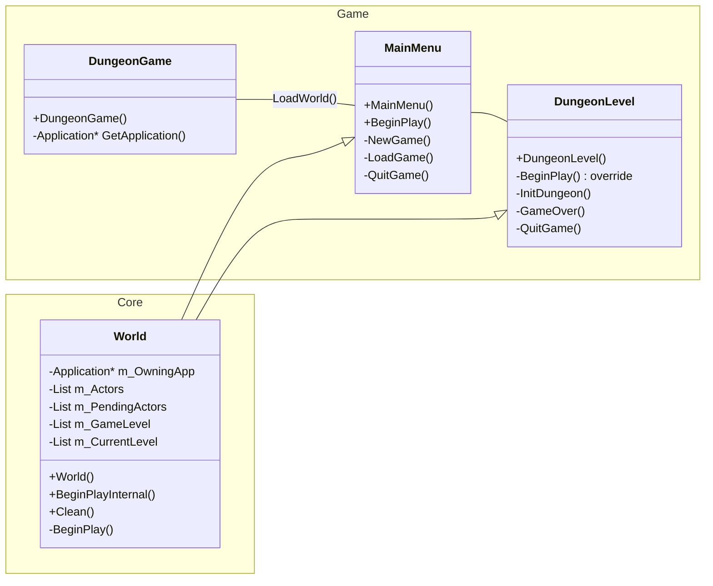
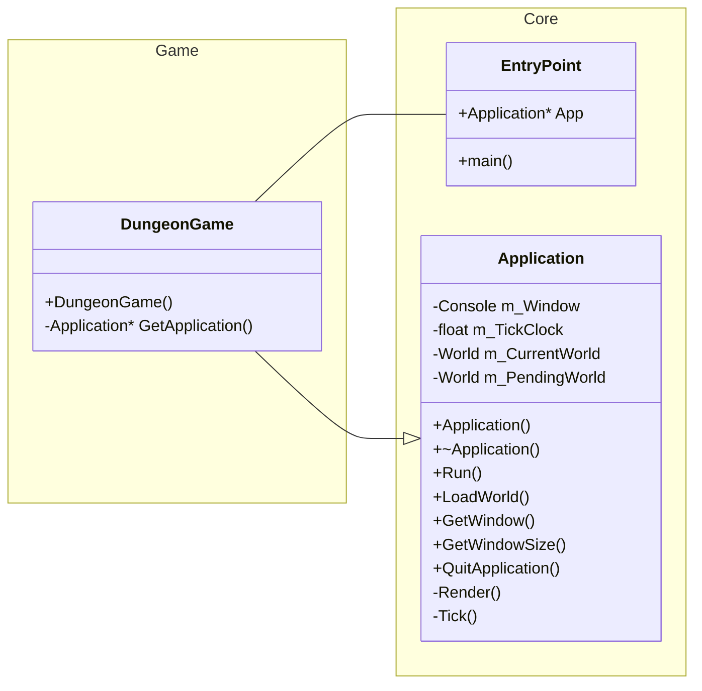

# Journal
Daily log of work done.
- Load the map
- Load assets for the map
- Place the assets on the map
- Place the player at player start

### 7/26/2024

#### Class Diagram

```mermaid
---
title: Dungeon Crawler
---
classDiagram
direction TD
    World <|-- Object
    Actor <|-- Object
    Widget <|-- Object
    TextWidget <|-- Widget
    HUD <|-- Object
    MainMenuHUD <|-- HUD
    MainMenuLevel <|-- World
    DungeonGame <|-- Application
    namespace Game {
        class DungeonGame {
            +DungeonGame(int, int, std::wstring&)
            +GetApplication() Application*
        }
        class MainMenuHUD {
            +MainMenuHUD()
            +Render(Renderer&) void
            +HandleEvent() bool
            -Init() void
            -m_MainMenuLayout TextWidget
            -m_MenuTitleText TextWidget
            -m_NewGameText TextWidget
            -m_QuitGameText TextWidget
        }
        class MainMenuLevel {
            +MainMenuLevel(Application*)
            +BeginPlay() void
            +Tick(float) void
            -StartGame() void
            -QuitGame() void
            -m_MainMenuHUD WeakPtr~MainMenuHUD~
        }
    }
    namespace Core {
        class Application {
            +Application(int, int, std::string&)
            +Run() void
            +LoadWorld WeakPtr~WorldType~
            +SetRenderIsDirty(bool) void
            -TickInternal(float) void
            -RenderInternal(Renderer&) void
            -Render(Rendrer&) void
            -Tick(float) void
            -ProcessInput() void
            -short m_WindowWidth
            -short m_WindowHeight
            -std::string m_Title
            -float m_TargetFrameRate;
            -Clock m_TickClock
            -SharedPtr~World~ m_CurrentWorld
            -SharedPtr~World~ m_PendingWorld
            -bool m_bRenderIsDirty
        }
        class Object {
            +Object()
            +~Object()
            +Destroy() void
            +IsPendingDestroy() bool
            +GetWeakRef() WeakPtr~Object~
            +GetUniqueID() int
            -uint m_UniqueID
            -bool m_IsPendingDestroy
        }
        class Actor {
            +Actor()
            +~Actor()
            +BeginPlayInternal() void
            +TickInternal(float) void
            +BeginPlay() void
            +Tick(float) void
            +Render(Renderer&) void
            +SetActorLocation(Vector2i) void
            +GetActorLocation() Vector2i
            +GetWorld() World*
            +Destroy() void
            +ApplyDamage() void
            +GetSprite() std::string&
            -World* m_OwningWorld
            -bool m_HasBeganPlay
            -bool m_IsRenderable
            -std::string m_Sprite
            -int m_OverrideColor
            -Transform m_Transform
        }
        class World {
            +World()
            +~World()
            +BeginPlayInternal() void
            +TickInternal(float) void
            +Render(Renderer) void
            +SpawnActor() WeakPtr<Actor>
            +SpawnHUD() WeakPtr<HUD>
            +GetApplication() Application*
            -BeginPlay() void
            -Tick(float) void
            -RenderHUD(Renderer&) void
            -Application* m_OwningApp
            -bool m_bBeginPlay
            -List<SharedPtr<Actor>> m_Actors
            -List<SharedPtr<Actor>> m_PendingActors
            -SharedPtr<HUD> m_HUD;
        }
        class Renderer {
            +Renderer()
            +Init(std::wstring) void
            +ClearConsoleScreen() void
            +DrawObject(Object&) void
            +DrawUI(Widet&, Vector2i) void
            +DisplayRenderBuffer() void
            -FixConsoleWindow() void
            -HideCursor() void
            -GoToXY(int, int) void
            -AddElementToRenderBuffer(CHAR_INFO, Vector2i) void
            -SetConsoleColor(int) void
            -m_RenderBuffer std::array<CHAR_INFO>
        }
        class HUD {
            +Render(Renderer&) void
            +InitInternal() void
            +HasInit() bool
            +HandleEvent() bool
            +Tick() void
            #HUD()
            -Init() void
            -m_HasInit bool
        }
        class Widget {
            +RenderInternal(Renderer&) void
            +SetWidgetPosition(Vector2i) void
            +GetWidgetPosition() Vector2i
            +SetVisibility(bool) void
            +GetVisibility() bool
            +SetDoesNeedUpdate(bool) void
            +GetDoesNeedUpdate() bool
            #Widget()
            -Render(Renderer&) void
            -LocationUpdated(Vector2i) void
            -Transform m_WidgetTransform
            -bool m_IsVisisble
            -bool m_DoesNeedUpdate
        }
        class TextWidget {
            +TextWidget()
            +TedtWidget(std::string&)
            +SetText(std::string&) void
            +GetText() std::string
            -Render(Renderer&) void
            -std::string m_Text
        }
        class Input {
            +Input()
            +Update() void$
            +GetKeyDown() int$
            +AddListener() void$
            +RemoveListener() void$
            +CleanUp() void$
            -m_KeyDown int$
            -m_InputListeners std::vector~std::function~$
        }
    }
```

### 7/25/2024

Did a ton today. Created a base class for UI Widgets and derived a `TextWidget` class from `Widget` base class. Created a virtual `HUD` base class to manage UI functionality and derived `MainMenuHUD`, implemented a basic main menu. And by basic I mean non-functional, just for looks at the moment. Input will be finished tomorrow. Updated the MainMenuLevel to spawn the MainMenuHUD to draw the main menu. Added a Constants header file to hold game-specific constants, specifically for the screen width and height.

Created a `Vector2i` helper class for 2D integer Vectors to help with positioning elements on the screen. Also added a `Transform` class to hold all the transform data for game objects. Currently, it only holds position, but I plan on extending it to scale to account for larger objects and UI elements. 

A big step forward was finishing the base implementation of the `Renderer` class which holds a render buffer in memory until the frame is complete at which point it draws the buffer to the console screen. 

Added an `Actor` class, derived from `Object`, to represent any game object that can be displayed on the screen. Updated the `World` class to hold a pointer to all Actors in the World and the ability to spawn actors into the World.

Updated the `Application` and `DungeonGame` classes to implement the `Renderer`.

#### Working some problems
Still left to do...
##### Movement
Input is polled every frame and if any of the movement keys are pressed (W, A, S, D or arrow keys), the players token moves one tile in that direction if it is allowed to. To keep things simple, all Game Objects are blocking objects, meaning you can't move into a tile that's occupied.

##### Interaction
If an object is interactable. Open doors. Pick up items.
Within a radius if 1 tile, interaction HUD pops up.

##### Player
Classes: Warrior, mage, rouge.
Inventory:

##### Map
Map is loaded from file. World reads the map and spawns in required game objects.

### 7/24/2024

#### Working some problems
##### Render Pipeline
Need to figure out the render pipeline and how to get the Actor's display properties up to the Renderer to be displayed in the console.

Step back a second... the way we draw in the console is to first define the render space size as a 2D grid, then move the cursor to a location on the grid with a coordinate (x, y), use std::cout to print a character to the console. That's really all that's involved in writing characters to the console.

Since I've already set up Tick with a target draw rate of 60 fps, I can cache all the draw calls from the game objects in the world into a 2D display buffer that fills up as much as it can in 1/60 of a second, then draws it all in one go. The display buffer would be a representation of the console display and each Actor passes their Render parameters off for the Renderer to handle. 

The Renderer should define the window size and use that to view only the part of the World that is within the bounds of the Render view. So if the World is 200x100 tiles and the Render view is 80x30 we only see that section. This might be a nice-to-have as I can see moving the Render view could be complex. Do it if you have time.

So the Actor holds the character that represents it.
- `.` : empty tile
- `#` : corridor
- `@` : player
- `$` : pile of gold
- `!` : potion
- `^` : trap
- `a-z, A-Z` : monsters

The Actor should track if its state has changed this frame and needs to re-render. Actors should have a MarkRenderDirty() function to call at the end of anything that changes the Actor's display state.

So the pipeline would be:
- (Application)
  - End of Run loop call RenderInternal()
  - RenderInternal clears the screen
  - Calls Render()
  - Render calls Render() on the current World
- (World)
  - World::Render loops over the Actors in the world
    - Calls Render() on each Actor
  - World renders the HUD/UI
    - . 
- (Actor)
  - Actor::Render returns if IsPendingDestroy or !IsRenderable
  - Actor calls Draw on the Renderer, adding itself with a payload (location, character, color) to the Render buffer
- (Application)
  - Calls Dispaly on the Renderer which writes the buffer to the console
- (Renderer)
  - iterates through the 2D buffer and either draws each character in sequence, or find a way to draw the buffer at once

##### Input
I don't think std::cin is going to work. Looks like Windows console has a library in the Standard C++ Library called conio.h that includes methods to fetch input from the console. I think this is the way to poll user input every frame.

### 7/21/2024
Created a Clock class to handle render timings and as a base class for any other timers that might be needed in-game. Created a Types.h files that defines datatypes. Created base Object class that all game objects will inherit from. Currently, it's only assigning a unique id to the object. Created World class that manages the loading, unloading, time management for all objects in the world. Created a Renderer class the handle visual rendering to the console.

### 7/20/2024
Got a basic drawing working on the console. I can move the cursor to a specific coordinate in the console window and draw text into the console buffer. Need to make sure I only update if something has changed, and if possible, only updated the cells that have changed. Implemented basic control to only render if we need to, i.e. RenderIsDirty equals true.

### 7/19/2024
Today I worked mostly on design and setting up the application/game framework. I'm not going to do any static library linking, instead just going to separate the core logic into a folder to keep it separate from gameplay.

**EntryPoint::main()** in Core calls **GetApplication()** that is defined in DungeonGame.cpp (will probably rename that file soon), which creates a Game object on the heap and returns a pointer to EntryPoint which immediately calls **Run()** on the Game. 

### 7/18/2024
Did a ton of research on ways to work with the Windows console window without using a library. I think I'm going to have to use the Windows Console API to work with the console directly. Pretty much all the libraries I found were just wrappers for the console api anyway.

In the console api, [WriteConsole()](https://learn.microsoft.com/en-us/windows/console/writeconsole) writes a character string to a console screen buffer beginning at the current cursor location. I can specify a location in the console with [SetConsoleCusrorPosition()](https://learn.microsoft.com/en-us/windows/console/setconsolecursorposition), which takes in a HANDLE to the console screen buffer, and [COORD](https://learn.microsoft.com/en-us/windows/console/coord-str) struct that specifies the new cursor position, in characters. The coordinates are the column and row coordinates of a cell in the console screen buffer.

[ReadConsole()](https://learn.microsoft.com/en-us/windows/console/readconsole) gets keyboard input, passing in a handle to the console's input buffer. It returns keyboard events that can be translated into ANSI or Unicode characters.

This is manageable, I think. It's very similar to how OpenGL handles vertex buffers, so approach it from that angle. Next step is to block it out; get a screen loaded and try and draw the title screen. If I can do that tomorrow, I should be fine to proceed.

Ok, for the application design itself...

I want to take a Game Engine approach and separate the Core logic from the Game logic. So building the _engine_ as a static library and link it into the _game_:

### 7/17/2024
Created requirements document with minimum requirements to make a functional game. Began R&D on how to approach the user interface. There's a few low-level libraries that can do the arrow key movement, but I want to see if I can do it with native C++ Standard Library modules first. It seems [Windows.h](https://learn.microsoft.com/en-us/windows/console/console-functions) has some functions that control the terminal window directly, so need to explore that. Got some initial ideas down for the Map class.

### 7/16/2024
Created project files and git repository.
