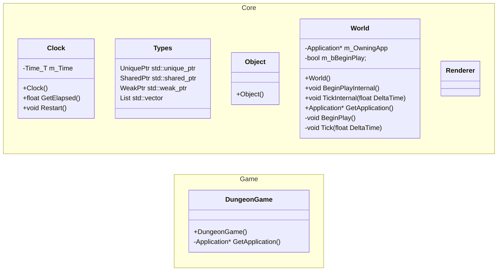
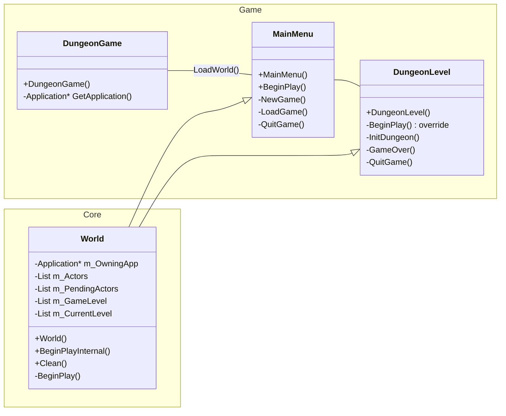
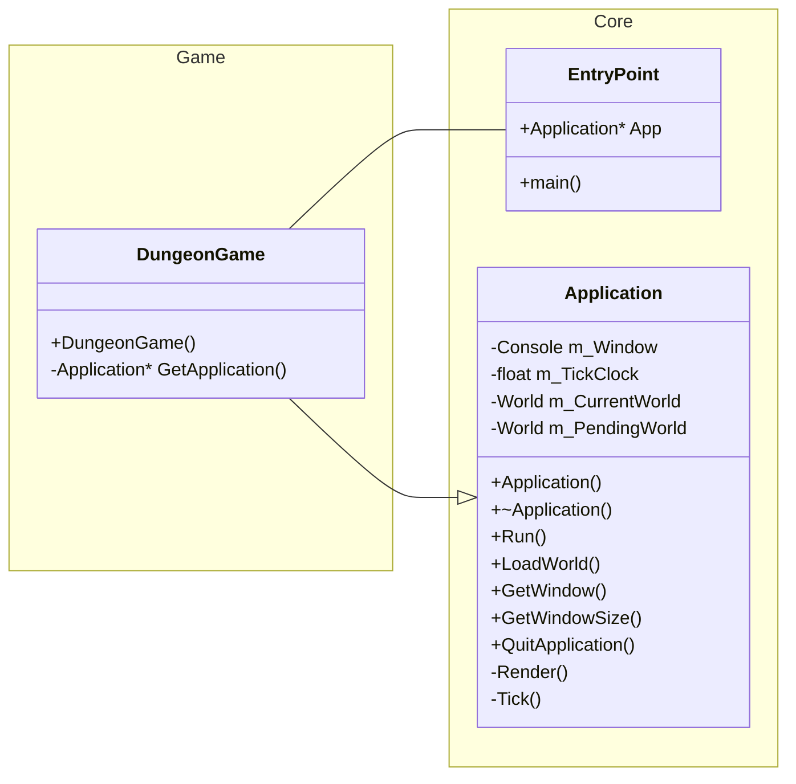

# Journal
Daily log of work done.

### 7/21/2024
Created a Clock class to handle render timings and as a base class for any other timers that might be needed in-game. Created a Types.h files that defines datatypes. Created base Object class that all game objects will inherit from. Currently, it's only assigning a unique id to the object. Created World class that manages the loading, unloading, time management for all objects in the world. Created a Renderer class the handle visual rendering to the console.

### 7/20/2024
Got a basic drawing working on the console. I can move the cursor to a specific coordinate in the console window and draw text into the console buffer. Need to make sure I only update if something has changed, and if possible, only updated the cells that have changed. Implemented basic control to only render if we need to, i.e. RenderIsDirty equals true.

### 7/19/2024
Today I worked mostly on design and setting up the application/game framework. I'm not going to do any static library linking, instead just going to separate the core logic into a folder to keep it separate from gameplay.

**EntryPoint::main()** in Core calls **GetApplication()** that is defined in DungeonGame.cpp (will probably rename that file soon), which creates a Game object on the heap and returns a pointer to EntryPoint which immediately calls **Run()** on the Game. 

### 7/18/2024
Did a ton of research on ways to work with the Windows console window without using a library. I think I'm going to have to use the Windows Console API to work with the console directly. Pretty much all the libraries I found were just wrappers for the console api anyway.

In the console api, [WriteConsole()](https://learn.microsoft.com/en-us/windows/console/writeconsole) writes a character string to a console screen buffer beginning at the current cursor location. I can specify a location in the console with [SetConsoleCusrorPosition()](https://learn.microsoft.com/en-us/windows/console/setconsolecursorposition), which takes in a HANDLE to the console screen buffer, and [COORD](https://learn.microsoft.com/en-us/windows/console/coord-str) struct that specifies the new cursor position, in characters. The coordinates are the column and row coordinates of a cell in the console screen buffer.

[ReadConsole()](https://learn.microsoft.com/en-us/windows/console/readconsole) gets keyboard input, passing in a handle to the console's input buffer. It returns keyboard events that can be translated into ANSI or Unicode characters.

This is manageable, I think. It's very similar to how OpenGL handles vertex buffers, so approach it from that angle. Next step is to block it out; get a screen loaded and try and draw the title screen. If I can do that tomorrow, I should be fine to proceed.

Ok, for the application design itself...

I want to take a Game Engine approach and separate the Core logic from the Game logic. So building the _engine_ as a static library and link it into the _game_:

### 7/17/2024
Created requirements document with minimum requirements to make a functional game. Began R&D on how to approach the user interface. There's a few low-level libraries that can do the arrow key movement, but I want to see if I can do it with native C++ Standard Library modules first. It seems [Windows.h](https://learn.microsoft.com/en-us/windows/console/console-functions) has some functions that control the terminal window directly, so need to explore that. Got some initial ideas down for the Map class.

### 7/16/2024
Created project files and git repository.
